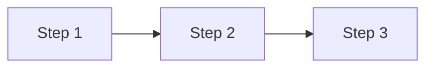
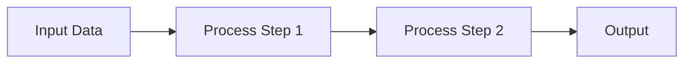

# 🎯 PHASE 2 : Récapitulatif Complet

## ✅ Ce que Phase 1 a fait (Rappel)

Vous avez entraîné un **Projection Module** qui fait :
```
Description texte → 8 Graph Words (8 x 256D)
```

**Résultat Phase 1 :**
- ✅ Module entraîné sauvegardé
- ✅ Val Loss < 0.05
- ✅ Graph Words contiennent l'info essentielle du graphe

**MAIS** : Ne génère PAS encore le code Mermaid complet !

---

## 🎯 Ce que Phase 2 va faire

Ajouter un **Décodeur GPT-2** qui fait :
```
8 Graph Words → Code Mermaid complet
```

**Pipeline Complet après Phase 2 :**
```
Description
    ↓
[Projection Module] Phase 1 ✅
    ↓
Graph Words (8 x 256D)
    ↓
[GPT-2 Decoder] Phase 2 🎯
    ↓
Code Mermaid
```

---

## 🏗️ Architecture Phase 2

### Composants

1. **Phase 1 (Déjà entraîné)**
   - Text Encoder : all-MiniLM-L6-v2
   - Projection Module : MLP + Self-Attention
   - Output : 8 Graph Words x 256D

2. **Phase 2 (À entraîner MAINTENANT)**
   - Graph-to-GPT2 Projection : 256D → 768D
   - GPT-2 Decoder : Génération token par token
   - Output : Code Mermaid complet

### Comment ça marche

```python
# 1. Caption → Graph Words (Phase 1)
caption = "Flowchart with 3 steps"
text_embedding = text_encoder(caption)  # 384D
graph_words = projection_module(text_embedding)  # 8 x 256D

# 2. Graph Words → GPT-2 Embeddings
gpt2_embeddings = graph_to_gpt2(graph_words)  # 8 x 768D

# 3. GPT-2 génère le code
# Les 8 embeddings servent de "contexte" pour GPT-2
# GPT-2 génère ensuite : "flowchart LR A --> B ..."
code = gpt2.generate(gpt2_embeddings)
```

---

## ⚡ Exécution (1 SEULE Commande)

```bash
cd /home/claude/graphsgpt_project
python scripts/phase2_complete_training.py
```

**C'est TOUT !**

Le script fait automatiquement :
1. ✅ Charge Phase 1 (projection module)
2. ✅ Initialise GPT-2
3. ✅ Crée le modèle complet
4. ✅ Entraîne pendant 30 epochs
5. ✅ Génère des exemples de test
6. ✅ Sauvegarde le meilleur modèle

**Durée :** 4-8h (CPU) | 1-2h (GPU)

---

## 📊 Différences Phase 1 vs Phase 2

| Aspect | Phase 1 | Phase 2 |
|--------|---------|---------|
| **Input** | Caption (texte) | Graph Words |
| **Output** | Graph Words (vecteurs) | Code Mermaid (texte) |
| **Loss** | MSE (reconstruction) | Cross-Entropy (génération) |
| **Difficulté** | Moyenne | Difficile |
| **Epochs** | 50-100 | 20-30 |
| **Val Loss cible** | < 0.05 | < 1.5 |
| **Durée** | 2-4h | 4-8h |

---

## 🎓 Comprendre la Génération Token par Token

### Comment GPT-2 génère le code

**Étape 1 : Contexte**
```
GPT-2 voit : [Graph Word 1] [Graph Word 2] ... [Graph Word 8]
```

**Étape 2 : Génération Progressive**
```
Token 1: "flowchart"
  → GPT-2 prédit : "LR"

Token 2: "LR"  
  → GPT-2 prédit : "A"

Token 3: "A"
  → GPT-2 prédit : "["

Token 4: "["
  → GPT-2 prédit : "Step"

... continue jusqu'à </s>
```

**Étape 3 : Résultat**


### Loss Function

Pour chaque token, GPT-2 calcule :
```python
loss = CrossEntropy(predicted_token, actual_token)
```

Exemple :
- Prédit "LR" (correct) → loss faible
- Prédit "TD" (faux) → loss élevée

On ajuste les poids pour minimiser cette loss.

---

## ✅ Critères de Succès Phase 2

### Métriques Quantitatives

| Métrique | Objectif |
|----------|----------|
| Val Loss | < 1.5 |
| Syntaxe valide | > 90% |
| Structure correcte | > 70% |

### Métriques Qualitatives

**Générations doivent avoir :**
- ✅ Syntaxe Mermaid valide (pas d'erreurs de parsing)
- ✅ Type de diagramme correct (flowchart vs mindmap vs graph)
- ✅ Nombre de nœuds cohérent avec caption
- ✅ Structure logique (séquentielle, circulaire, hiérarchique)

---

## 📈 Évolution Attendue pendant Training

### Epochs 1-5 : Apprentissage de Base
```
Val Loss: ~3.0 → ~2.0
Qualité: Code invalide, bruit
Exemple: "flowchart asdf qwerty"
```

### Epochs 5-15 : Syntaxe
```
Val Loss: ~2.0 → ~1.2
Qualité: Syntaxe valide, structure basique
Exemple: "flowchart LR\n  A --> B"
```

### Epochs 15-30 : Raffinement
```
Val Loss: ~1.2 → ~0.8
Qualité: Syntaxe + structure cohérente
Exemple: "flowchart LR\n  A[Start] --> B[Process] --> C[End]"
```

---

## 🔧 Configuration Recommandée

### Configuration par Défaut (Bon pour 90% des cas)
```python
GPT2_MODEL = 'gpt2'
BATCH_SIZE = 8
LEARNING_RATE = 5e-5
NUM_EPOCHS = 30
```

### Si vous avez un GPU puissant
```python
GPT2_MODEL = 'gpt2-medium'  # Meilleure qualité
BATCH_SIZE = 16
NUM_EPOCHS = 50
```

### Si vous avez OOM (Out of Memory)
```python
BATCH_SIZE = 4  # ou même 2
GPT2_MODEL = 'gpt2'  # Pas medium
```

### Si loss ne diminue pas
```python
LEARNING_RATE = 1e-4  # Augmenter
FREEZE_PROJECTION_EPOCHS = 10  # Freezer Phase 1 au début
```

---

## 📂 Fichiers Créés

Le script `phase2_complete_training.py` créera :

```
graphsgpt_project/
├── models/phase2/
│   ├── best_complete_model.pt       ⭐ Modèle complet
│   ├── checkpoint_epoch_5.pt
│   ├── checkpoint_epoch_10.pt
│   └── ...
│
└── outputs/phase2/
    ├── training_history.json        📊 Courbes de loss
    └── generated_samples.json       📝 5 exemples générés
```

---

## 🎯 Exemple Concret de Génération

### Input (Caption)
```
"Sequential process with 4 steps showing data flow"
```

### Processing Interne
```
1. Caption → Text Embedding (384D)
2. Text Embedding → Graph Words (8 x 256D)
3. Graph Words → GPT-2 Context
4. GPT-2 génère token par token
```

### Output (Generated Code)


---

## 💡 Astuces Importantes

### 1. Ne pas comparer directement les loss
- Phase 1 loss : MSE (nombres entre 0-1)
- Phase 2 loss : Cross-Entropy (peut être 0-5+)
- **Ne PAS comparer** : 0.04 (Phase 1) vs 0.9 (Phase 2)

### 2. La génération prend du temps
- Normal que les 10 premiers epochs soient mauvais
- Amélioration progressive et continue
- Patience = clé du succès

### 3. Progressive Unfreezing (optionnel)
Si vous voulez être prudent :
```python
FREEZE_PROJECTION_EPOCHS = 10
```
Cela va :
- Epochs 1-10 : Train SEULEMENT GPT-2, Phase 1 frozen
- Epochs 11+ : Train TOUT (Phase 1 + GPT-2)

### 4. Validation humaine
Regardez les exemples générés :
- `outputs/phase2/generated_samples.json`
- Vérifiez manuellement la qualité
- C'est normal si pas parfait !

---

## 🐛 Résolution de Problèmes

### Problème : "Phase 1 checkpoint not found"
**Solution :**
```bash
ls models/best_projection_module.pt
# Si absent, relancer Phase 1
python scripts/phase1_complete_training.py
```

### Problème : CUDA Out of Memory
**Solution :**
```python
# Dans phase2_complete_training.py, modifier Config:
BATCH_SIZE = 4  # Réduire
```

### Problème : Loss ne diminue pas
**Solution 1 :** Augmenter LR
```python
LEARNING_RATE = 1e-4
```

**Solution 2 :** Freezer Phase 1 au début
```python
FREEZE_PROJECTION_EPOCHS = 10
```

### Problème : Code généré invalide
**C'est normal !**
- Epochs 1-10 : Code souvent invalide
- Epochs 10-20 : Syntaxe devient valide
- Epochs 20+ : Structure cohérente

**Action :** Continuer l'entraînement, ça va s'améliorer

---

## 📚 Fichiers Créés pour Vous

Vous avez maintenant :

1. **phase2_complete_training.py** (Script principal)
   - 600+ lignes de code complet
   - Tout automatique
   
2. **PHASE2_GUIDE.md** (Guide détaillé)
   - Instructions complètes
   - Troubleshooting

3. **PHASE2_RECAP.md** (Ce fichier)
   - Résumé complet
   - Vue d'ensemble

---

## ➡️ Action Immédiate

### Lancez Phase 2 MAINTENANT :

```bash
cd /home/claude/graphsgpt_project
python scripts/phase2_complete_training.py
```

### Pendant l'entraînement (4-8h) :

Vous pouvez :
- ☕ Prendre un café
- 📚 Lire la documentation
- 💻 Préparer l'évaluation finale
- 🎮 Jouer à un jeu

### Après l'entraînement :

1. Vérifier `outputs/phase2/generated_samples.json`
2. Évaluer la qualité manuellement
3. (Optionnel) Tester avec votre GNN-VAE
4. Célébrer ! 🎉

---

## 🎉 Après Phase 2 : Vous Aurez

Un système COMPLET :
```
Caption → Code Mermaid
```

Avec :
- ✅ Pipeline end-to-end fonctionnel
- ✅ Génération automatique de diagrammes
- ✅ Syntaxe Mermaid valide
- ✅ Structure cohérente avec description

**Votre contribution originale :**
- Architecture custom GraphsGPT-inspired
- Projection Module innovant
- Pipeline complet caption-to-diagram

**Applications possibles :**
- Génération automatique de documentation
- Prototypage rapide de diagrammes
- Assistance à la conception système
- Génération de flowcharts depuis spécifications

---

## 🚀 Résumé Ultra-Court

**Une seule commande :**
```bash
python scripts/phase2_complete_training.py
```

**Résultat :**
```
Caption → Mermaid Code ✨
```

**Durée :** 4-8h

**Difficulté :** Le script fait TOUT automatiquement

---

**BON COURAGE ! 🎉**

Le plus dur est fait (Phase 1). Phase 2 est juste ajouter le décodeur.

Vous avez tous les fichiers, lancez et laissez tourner !
