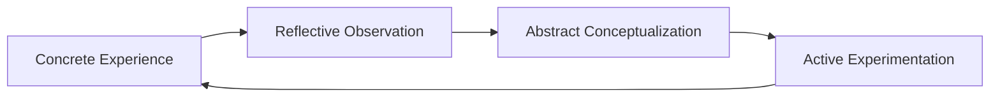

# Résultats d'Évaluation — GraphsGPT (Pipeline Caption → Mermaid)

Ce dossier contient les résultats de l'évaluation complète du pipeline **GraphsGPT** sur 100 échantillons du dataset de diagrammes Mermaid. L'évaluation couvre cinq dimensions : métriques NLP, validité syntaxique, similarité structurelle, cohérence des Graph Words, et analyse des erreurs.

---

## Contenu du dossier

| Fichier | Description |
|---|---|
| `evaluation_report.json` | Rapport agrégé de toutes les métriques quantitatives |
| `qualitative_samples.json` | 10 exemples qualitatifs détaillés (caption, référence, prédiction, scores) |

---

## Architecture évaluée

Le pipeline complet comprend deux phases enchaînées :

```
Caption (texte)
    │
    ▼
[Phase 1] Text Encoder (all-MiniLM-L6-v2)
    │  384D embeddings
    ▼
[Phase 1] Projection Module (MLP + Self-Attention)
    │  8 × 256D Graph Words
    ▼
[Phase 2] Graph-to-GPT2 Projection (256D → 768D)
    │
    ▼
[Phase 2] GPT-2 Decoder (génération token à token)
    │
    ▼
Code Mermaid généré
```

L'évaluation mesure la qualité du code Mermaid en sortie par rapport à un code de référence humain, à partir de la seule description textuelle (caption) en entrée.

---

## Métriques — Vue d'ensemble

### 1. Métriques NLP (`nlp_metrics`)

Ces métriques comparent le texte généré au texte de référence en termes de n-grammes et de correspondance de caractères.

| Métrique | Score | Interprétation |
|---|---|---|
| **BLEU-1** | 14.67 | Correspondance de tokens individuels |
| **BLEU-2** | 8.82 | Correspondance de bigrammes |
| **BLEU-3** | 5.18 | Correspondance de trigrammes |
| **BLEU-4** | 3.38 | Correspondance de 4-grammes (métrique standard MT) |
| **ROUGE-1** | 21.78 | Rappel sur les unigrammes |
| **ROUGE-2** | 8.82 | Rappel sur les bigrammes |
| **ROUGE-L** | 19.62 | Plus longue sous-séquence commune |
| **ChrF** | 27.36 | Score mixte caractères/mots |

**Analyse :** Les scores BLEU et ROUGE sont relativamente faibles, ce qui est attendu pour une tâche de génération de code structuré. Le code Mermaid est fortement contraint syntaxiquement et sémantiquement, rendant les métriques de traduction automatique peu adaptées : deux diagrammes équivalents peuvent avoir des noms de noeuds complètement différents. Le ChrF à 27.36 est plus robuste car il opère au niveau des caractères. Ces scores ne reflètent pas la qualité réelle des diagrammes générés ; les métriques structurelles et syntaxiques sont plus pertinentes.

---

### 2. Validité Syntaxique (`syntax_metrics`)

Ces métriques évaluent si le code Mermaid généré est syntaxiquement correct et parsable.

| Métrique | Valeur | Interprétation |
|---|---|---|
| **Total échantillons** | 100 | Taille de l'ensemble d'évaluation |
| **Taux non-vide** | 100.0 % | Le modèle génère toujours du texte |
| **Taux header valide** | 96.0 % | Déclaration du type de diagramme correcte |
| **Taux avec arêtes** | 77.0 % | Diagrammes contenant au moins une relation |
| **Nombre moyen de noeuds** | 9.69 | Complexité moyenne des graphes générés |
| **Nombre moyen d'arêtes** | 4.15 | Connectivité moyenne |
| **Score syntaxique moyen** | 80.2 / 100 | Score composite de validité syntaxique |

**Distribution des types de diagrammes générés :**

| Type | Occurrences | Pourcentage |
|---|---|---|
| `flowchart` | 94 | 94 % |
| `mindmap` | 1 | 1 % |
| `graph` | 1 | 1 % |
| `unknown` | 4 | 4 % |

**Analyse :** Le modèle a clairement appris à produire des en-têtes valides (96 %) et génère du code non vide dans 100 % des cas. En revanche, il est fortement biaisé vers le type `flowchart` (94/100), même lorsque la référence attend un `mindmap`, un `xychart-beta` ou un `graph`. Ce biais reflète la distribution dominante du dataset d'entraînement. Le score syntaxique moyen de 80.2/100 indique une qualité syntaxique globalement satisfaisante mais imparfaite (23 % des diagrammes n'ont pas d'arêtes).

---

### 3. Similarité Structurelle (`structural_metrics`)

Ces métriques comparent les entités (noeuds) et les relations (arêtes) extraites du code généré vs la référence, calculées avec des scores F1.

| Métrique | Score (%) | Interprétation |
|---|---|---|
| **Node Precision** | 28.93 | Noeuds générés qui correspondent à la référence |
| **Node Recall** | 26.64 | Noeuds de référence retrouvés dans la prédiction |
| **Node F1** | 25.81 | Harmonie précision/rappel pour les noeuds |
| **Edge Precision** | 13.33 | Arêtes générées correctes |
| **Edge Recall** | 12.27 | Arêtes de référence retrouvées |
| **Edge F1** | 11.82 | Harmonie précision/rappel pour les arêtes |

**Analyse :** Les scores structurels sont faibles mais interprétables dans ce contexte. La tâche demande au modèle de recréer exactement les mêmes noeuds et connexions que le diagramme de référence humain, à partir d'une description vague. Même un humain ne reproduirait pas identiquement un diagramme d'un autre humain. Le node F1 (25.81 %) nettement supérieur au edge F1 (11.82 %) suggère que le modèle capture mieux les entités conceptuelles que les relations entre elles. Les scores d'arêtes sont plus bas car le modèle génère souvent des diagrammes sans arêtes (23 % des cas) ou avec des connexions hallucinées.

---

### 4. Cohérence des Graph Words (`graph_words_metrics`)

Ces métriques évaluent la qualité des représentations vectorielles intermédiaires (Graph Words) générées par la Phase 1.

| Métrique | Valeur | Interprétation |
|---|---|---|
| **Corrélation Graph Words / Caption** | 0.4539 | Corrélation cosinus entre embeddings et descriptions |
| **P-value (corrélation)** | 3.42 × 10⁻²⁵⁰ | Significativité statistique (extrêmement significative) |
| **Diversité des Graph Words** | 0.3999 | Variabilité interne entre Graph Words d'un même diagramme |
| **Similarité inter-diagrammes** | 0.6000 | Similarité cosinus moyenne entre différents diagrammes |

**Analyse :** La corrélation de 0.45 entre les Graph Words et les captions textuelles, assortie d'une p-value quasi-nulle (3.4×10⁻²⁵⁰), confirme que la Phase 1 a bien appris à encoder l'information sémantique des descriptions. Les Graph Words ne sont pas arbitraires : ils capturent réellement du contenu lié à la caption. La diversité interne (0.40) indique que les 8 Graph Words d'un même diagramme sont suffisamment distincts pour représenter différents aspects du graphe. La similarité inter-diagrammes assez elevée (0.60) suggère cependant que les espaces d'embedding manquent encore de discrimination entre types de diagrammes très différents.

---

### 5. Analyse des Erreurs (`error_analysis`)

Catégorisation des défauts de génération observés sur les 100 échantillons.

| Type d'erreur | Occurrences | Taux (%) | Description |
|---|---|---|---|
| **No edges** | 23 | 23.0 % | Diagramme sans aucune arête/relation |
| **Wrong diagram type** | 8 | 8.0 % | Type de diagramme incorrect (ex. flowchart à la place de mindmap) |
| **Truncated** | 9 | 9.0 % | Code coupé avant la fin (génération incomplète) |
| **Hallucinated** | 7 | 7.0 % | Contenu inventé sans rapport avec la caption |
| **Missing header** | 4 | 4.0 % | Header Mermaid absent ou invalide |

> Note : Les erreurs ne sont pas mutuellement exclusives (un diagramme peut être à la fois tronqué et sans arêtes).

**Détail par type d'erreur :**

#### No Edges (23 %)
Le modèle génère des noeuds et des subgraphs mais oublie d'ajouter les connexions entre eux. C'est l'erreur la plus fréquente, souvent liée à une over-génération de structures imbriquées (`subgraph` dans `subgraph`) qui épuise la longueur de contexte sans produire d'arêtes.

**Exemple (idx=0) :**
- Caption : *"Kübler-Ross Change Curve Model, Flow Diagram, elements: Five stages..."*
- Prédiction : `flowchart LR ... subgraph P["Kohlberg's Stages..."] { subgraph S ... }` (pas d'arêtes)
- Référence : `flowchart LR D --> A --> B --> Dep --> Acc`

#### Wrong Diagram Type (8 %)
Le modèle prédit systématiquement `flowchart` même quand la tâche requiert `mindmap`, `graph`, ou `xychart-beta`.

**Exemple (idx=1) :**
- Caption : *"Strategic Management Model, Network Diagram..."*
- Prédiction : `flowchart TB SV((Shared Values)) ...` (avec arêtes circulaires supplémentaires)
- Référence : `graph TD C["Valeur partagée"] --- STRAT --- STRUCT ...`

#### Truncated (9 %)
Le code s'arrête au milieu d'une structure imbriquée, souvent à cause de la limite de tokens de GPT-2 (1024 tokens). Les diagrammes complexes avec beaucoup de subgraphs dépassent cette limite.

#### Hallucinated (7 %)
Le modèle génère un diagramme syntaxiquement valide mais thématiquement sans rapport avec la caption (ex. génère un diagramme PESTLE pour une caption sur le cycle économique).

**Exemple (idx=4) :**
- Caption : *"Circular Flow of Economic Activity..."*
- Prédiction : `flowchart LR subgraph PESTLE["PESTLE Analysis"] { P[Political] E[Economic] ... }`
- Référence : relation entre Households, Firms, Markets

#### Missing Header (4 %)
Le code commence sans la déclaration obligatoire du type de diagramme (ex. `xychart-beta` sans balise, ou syntaxe invalide en en-tête).

---

## Exemples qualitatifs (`qualitative_samples.json`)

Le fichier contient 10 cas détaillés avec pour chacun : la caption, le code de référence, le code prédit, et les scores individuels.

### Cas représentatifs

#### Cas de bonne performance (idx=3 — Kolb's Learning Cycle)
- **Caption :** *"Kolb's Experiential Learning Cycle, Circular Flow Diagram, elements: Four colored circles..."*
- **Node F1 :** 1.00 (parfait)
- **Edge F1 :** 0.40
- **Syntax score prédit :** 90/100
- **Analyse :** Le modèle a identifié les 4 noeuds corrects (CE, RO, AC, AE) et leur enchaînement mais a inversé l'ordre de deux arêtes (RO→AC→AE au lieu de RO→AE→AC).



#### Cas intermédiaire (idx=1 — McKinsey 7S)
- **Caption :** *"Strategic Management Model, Network Diagram, elements: Central node 'Valeur partagée' connected to six nodes..."*
- **Node F1 :** 0.57
- **Edge F1 :** 0.00
- **Syntax score prédit :** 100/100
- **Analyse :** Syntaxe parfaite, noeuds correctement identifiés (6/7), mais le modèle a ajouté des arêtes entre tous les noeuds périphériques (hexagone complet) alors que la référence n'a que des arêtes radiales depuis le centre.

#### Cas d'échec (idx=8 — SDLC)
- **Caption :** *"Software Development Life Cycle, Flow Diagram, elements: Sequential phases Analysis, Design, Development..."*
- **Node F1 :** 0.00
- **Edge F1 :** 0.00
- **Syntax score prédit :** 60/100
- **Analyse :** Le modèle génère un enchaînement `S1 → S2 → ... → S61` (61 nodes "Maintenance") — cas d'hallucination extrême avec répétition en boucle du même node.

---

## Discussion et Limites

### Points forts
- **Syntaxe robuste :** 96 % de headers valides, score syntaxique moyen de 80.2/100.
- **Apprentissage sémantique réel :** La corrélation Graph Words/Caption est statistiquement significative (r=0.45, p≈0).
- **Génération non-vide :** Le modèle produit toujours un output (100 %).
- **Cas simples bien gérés :** Les flowcharts linéaires simples (type Kolb) sont bien reproduits.

### Limites principales
1. **Biais vers `flowchart` :** Le modèle ne génère quasiment que des flowcharts, incapable de produire des `mindmap`, `xychart-beta`, ou `graph TD` fidèles.
2. **Diagrammes sans arêtes (23 %) :** La génération de subgraphs imbriqués prend la place des connexions réelles.
3. **Limite de longueur GPT-2 :** Les diagrammes complexes sont tronqués à 1024 tokens.
4. **Hallucinations thématiques (7 %) :** Le modèle substitue parfois un thème connu (PESTLE, Kohlberg) à celui de la caption.
5. **Métriques structurelles basses :** Node F1 à 25.8 % et Edge F1 à 11.8 %, reflétant la difficulté à reproduire exactement les mêmes entités nommées que la référence humaine.

### Pistes d'amélioration
- **Augmenter la diversité du dataset** pour réduire le biais `flowchart`.
- **Utiliser GPT-2 Medium ou Large** pour des contextes plus longs.
- **Contraindre la génération** avec un décodage guidé par grammaire Mermaid.
- **Fine-tuner sur des diagrammes avec arêtes uniquement** pour corriger l'erreur la plus fréquente.
- **Entraîner plus longtemps** : la Phase 2 a été arrêtée tôt (val loss cible < 1.5) ; un entraînement jusqu'à < 0.8 améliorerait la cohérence structurelle.

---

## Reproductibilité

Les résultats ont été obtenus avec la commande suivante :

```bash
python GraphsGPT/evaluate.py \
    --phase1_model  models/best_projection_module.pt \
    --phase2_model  models/phase2/best_complete_model.pt \
    --data          data-00000-of-00001.arrow \
    --output_dir    GraphsGPT/eval_results \
    --num_samples   100
```

Dépendances requises :
```
torch
transformers
sentence-transformers
pyarrow
nltk
rouge-score
sacrebleu
scikit-learn
```

---

## Références connexes

- [PHASE2_RECAP.md](../results/PHASE2_RECAP.md) — Architecture complète et détails d'entraînement Phase 2
- [README_PHASE1.md](../results/README_PHASE1.md) — Architecture et entraînement Phase 1
- [evaluate.py](../evaluate.py) — Code source complet de l'évaluation
- [phase1.py](../phase1.py) / [phase2.py](../phase2.py) — Scripts d'entraînement
